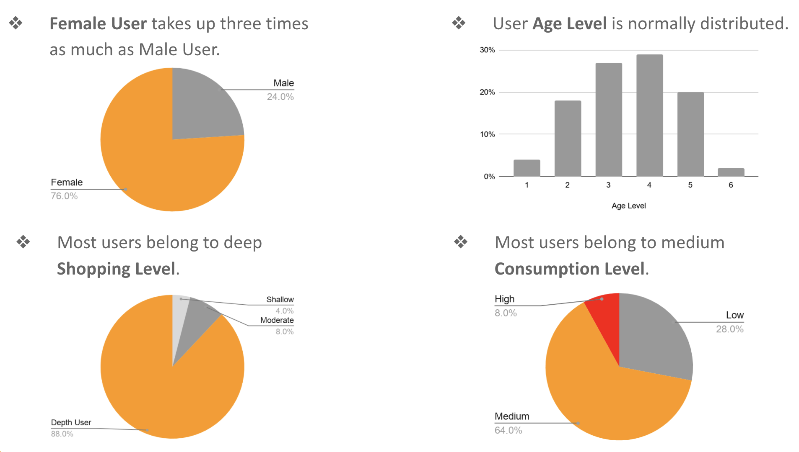
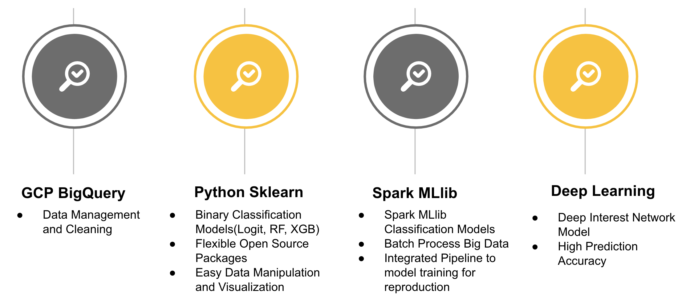

# Ads Click-Through-Rate Prediction
Predict ads click-through-rate on a user-ads category level.

## **Data**
[Ad Display/Click Data on Taobao.com](https://tianchi.aliyun.com/dataset/dataDetail?dataId=56)

This dataset is provided by Alimama and contains 1.14 million users behavior on Taobao.com platform.

| Table| Description| Feature
|---|---|---|
|raw_sample|	raw training samples	|User   ID, Ad ID, nonclk, clk, timestamp|
|ad_feature|	Ad’s basic information	|Ad   ID, campaign ID, Cate ID, Brand|
|user_profile	|user profile	|User   ID, age, gender, etc|
|raw_behavior_log	|User behavior log	|User   ID, btag, cate, brand, timestamp|

## **Data Preprocessing**
We used BigQuery to sample 5 million users from the dataset and merge all the tables.

## **Exploratory Data Analysis**

## **Models**

- Logistic Regression, Random Forest with Sklearn
- Logistic Regression, Random Forest with Spark MLlib
- [Deep Interest Network Model](https://arxiv.org/pdf/1706.06978.pdf)

**Deep Interest Network**

It introduces a local activation unit, with which the representation of user interests varies adaptively
given different candidate ads.
